<h1 align="center">Until Last Asteroid</h1>

<p align="center">
  A fast twin-stick space shooter — C++20 / SFML 3.1, hand-built engine, no game framework.
</p>

<p align="center">
  
  
  
  
  
  
</p>

<p align="center">
  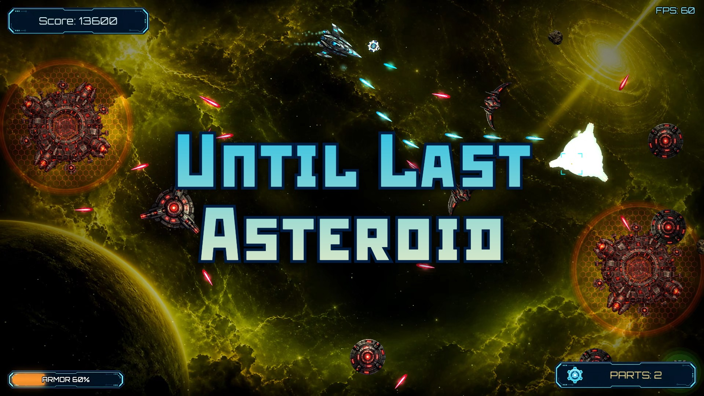
</p>

---

## What it is

You fly a lone ship into a collapsing asteroid frontier. Thrust, drift and
twin-stick your way through ten levels of splitting meteors, hunter-killer
saucers, shielded stations and a three-phase final boss — collecting ship Parts,
spending them on upgrades, and chasing a clean run on the records board.

Three ways to play:

- **Campaign** — 10 levels, each with its own space region, music theme and enemy mix
- **Horde** — endless escalating waves with per-wave upgrades
- **Run** — one hit and you are out; survive as long as you can

<table align="center">
  <tr>
    <td align="center">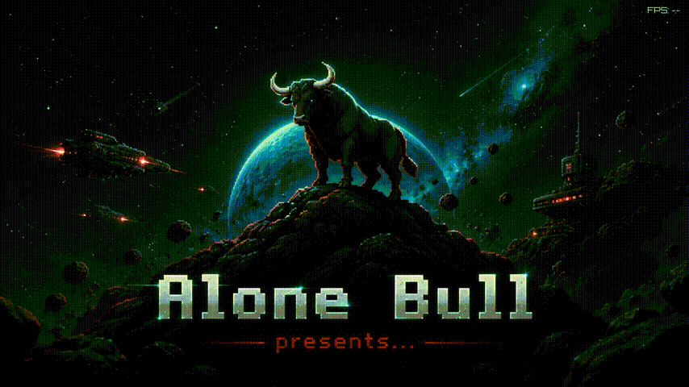<br><sub>Intro &amp; main menu</sub></td>
    <td align="center">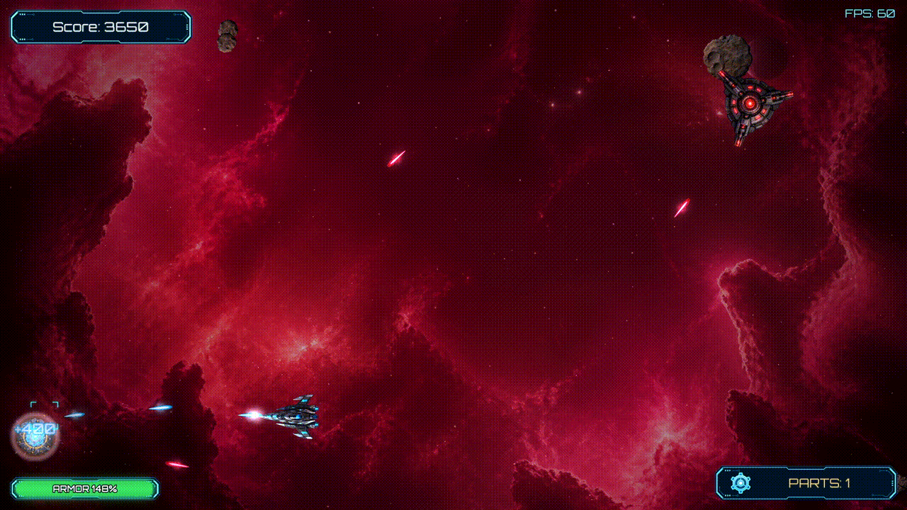<br><sub>Campaign flight</sub></td>
  </tr>
  <tr>
    <td align="center">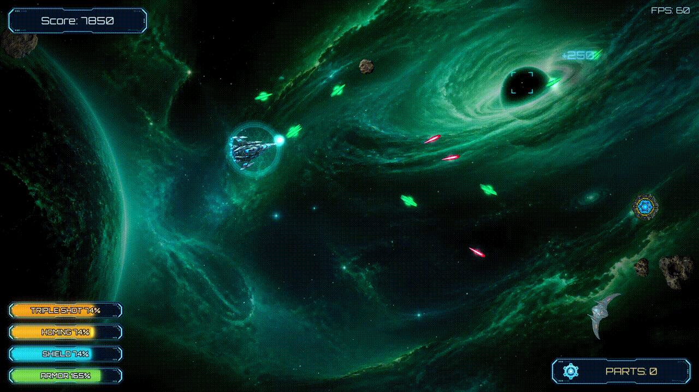<br><sub>Pickups &amp; bonuses</sub></td>
    <td align="center">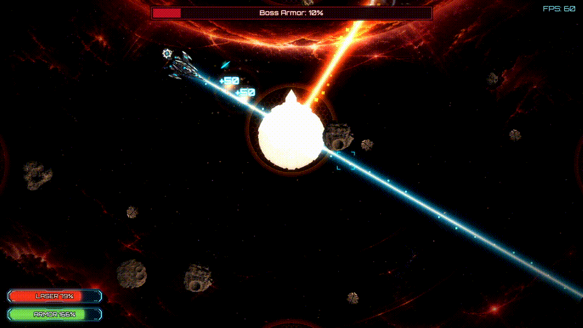<br><sub>Boss encounter</sub></td>
  </tr>
</table>

<p align="center">
  <a href="https://www.youtube.com/watch?v=LXShKttBFV4">
    
  </a>
  <br>
  ▶️ <a href="https://www.youtube.com/watch?v=LXShKttBFV4"><b>Watch the full playthrough (1080p60)</b></a>
</p>

---

## Download & play

**[⬇ Download the latest release](https://github.com/demianblogan/Until_Last_Asteroid/releases/latest)**

1. Download `UntilLastAsteroid-vX.Y.Z-win64.zip`
2. Extract it anywhere
3. Run `UntilLastAsteroid.exe` — the SFML DLLs are bundled

Windows 10 / 11, 64-bit. A gamepad is optional; Xbox and DualSense layouts are
built in.

---

## Features

### Modes
- **Campaign** — nine three-wave stages plus a dedicated boss stage, with a
  persistent, versioned save
- **Horde** — endless escalating rosters, one bonus per wave, cyclic run-only upgrades
- **Run** — one-hit rules, survival-time record, defensive pickups only
- Optional guided **tutorial** for movement, combat, scoring, armor, pickups,
  Parts and ship upgrades

### Progression
- Collectible **Parts** dropped by enemies, spent on four **ship-upgrade** branches
- **9 achievements**
- **Records** kept per campaign level and per survival mode, independent of the
  campaign save

### Combat & effects
- Twin-stick flight with acceleration, damping and Asteroids-style screen wrap
- Seven timed pickups — health, shield, homing bullets, time-slow, laser,
  triple-shot, helper bot
- Batched particle FX, projectile glow, hit flashes, camera shake, compound colliders
- Configurable post-processing: bloom, colour grading, vignette, damage feedback,
  explosion distortion

### Presentation
- 10 space regions with 4K backgrounds and parallax star / dust layers
- Three gameplay music themes plus a dedicated boss track
- Animated sci-fi menu, level intros, and polished result / game-over / victory screens
- Bloom-highlighted UI, custom menu cursor and gameplay crosshair

### Options
- **Graphics** — resolution, Fullscreen / Windowed / Borderless, V-Sync, FPS
  counter, post-processing toggle
- **Audio** — master, music and SFX volumes
- **Controls** — full keyboard + mouse rebinding; Xbox and DualSense layouts with
  automatic input switching; DualSense rumble, adaptive triggers and lightbar toggles
- **Gameplay** — screen-shake and score-popup toggles

Full breakdown: **[docs/GAMEPLAY.md](docs/GAMEPLAY.md)**

---

## Controls

| Action | Keyboard & mouse | Gamepad |
|---|---|---|
| Move | `W` `A` `S` `D` | Left stick |
| Aim | Mouse | Right stick |
| Shoot | Left Mouse Button | Right trigger (RT / R2) |
| Pause | `Esc` | Menu / Options button |
| Menus | Arrows, mouse, `Enter`, `Esc` | D-pad, ✕ / A confirm, ○ / B back |

All keyboard and mouse bindings can be reassigned in Options.
Full layouts including DualSense extras: **[docs/CONTROLS.md](docs/CONTROLS.md)**

---

## Enemies

| Sprite | Enemy | Behaviour | Score |
|:---:|---|---|:---:|
| 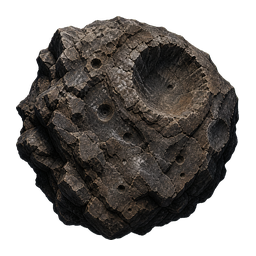 | Large Meteor | Slow drift; splits into two small meteors when destroyed | 100 |
| 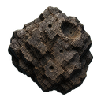 | Small Meteor | Faster, does not split | 50 |
| 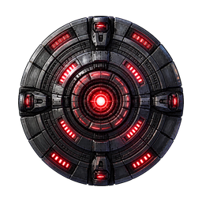 | Kamikaze Saucer | Spins and accelerates into a ramming run | 200 |
| 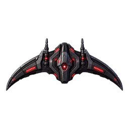 | Shooter | Holds range, alternates fire between two cannons | 250 |
| 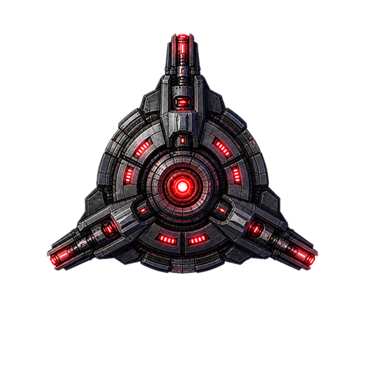 | Spinner | Sine-wave path while rotating and firing in three directions | 400 |
| 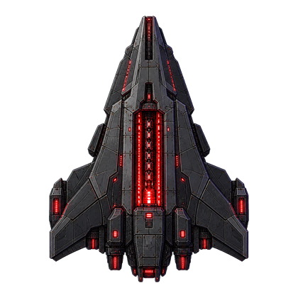 | Missile Carrier | Launches slow, destructible homing missiles | 350 |
| 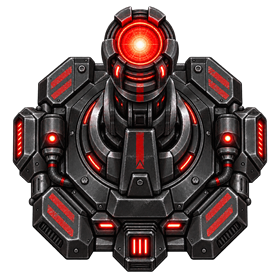 | Laser Turret | Patrols a screen edge with a player-only sweeping beam | 500 |
| 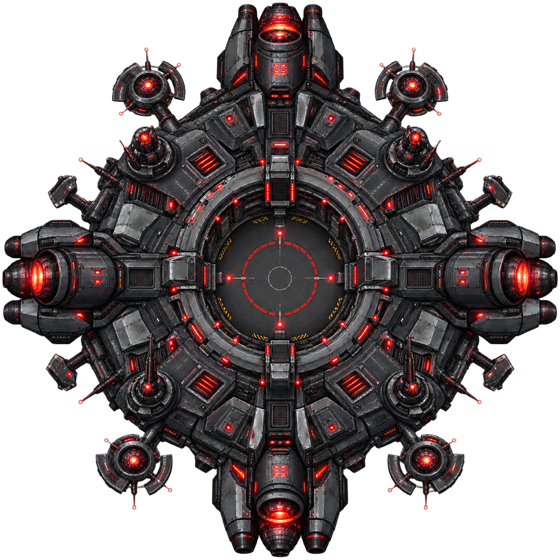 | Shooter Station | Shields its launch bay while constructing Shooters | 900 |
| 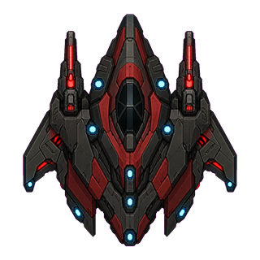 | Reflector Gunship | Fast twin cannons with a periodic bullet-reflecting shield | 750 |
| 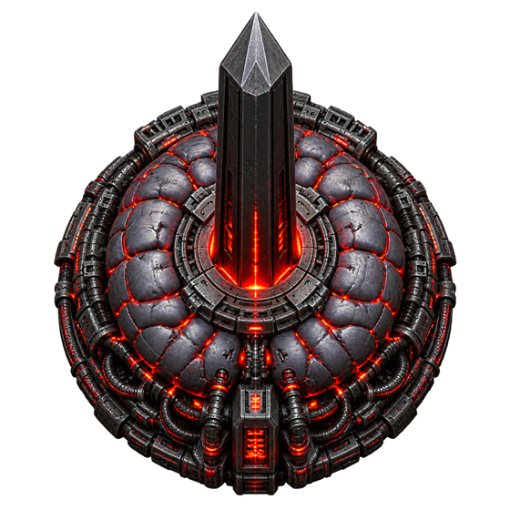 | **The Last Horizon** | Boss — three phases: outer ring, diamond frame, shielded core | — |

Per-enemy stats and tactics: **[docs/GAMEPLAY.md#bestiary](docs/GAMEPLAY.md#bestiary)**

---

## Save data

The game writes per-player data to:

```
%LOCALAPPDATA%\Alone Bull Company\Until Last Asteroid\
```

| File | Contents |
|---|---|
| `settings.json` | graphics, audio, control bindings, gameplay and language settings |
| `campaign.json` | campaign progress, collected Parts, ship-upgrade ranks |
| `records.json` | per-level scores, Horde best score / wave, Run best time |
| `achievements.json` | unlocked achievements |

If `%LOCALAPPDATA%` is unavailable, the game falls back to a `user_data\` folder
next to the executable. Writes are atomic, and a file that fails to parse is
quarantined as `<name>.corrupt` rather than overwritten.

---

## Building from source

Requires **Visual Studio 2026** (toolset `v145`), the Windows 10 SDK, and
**SFML 3.1.0 (64-bit)**. The project is a plain `.vcxproj` — no CMake or vcpkg.

1. Build SFML 3.1.0 and drop its `include/` and `lib/` into `libs/SFML/` —
   see **[libs/SFML/README.md](libs/SFML/README.md)**
2. Open `UntilLastAsteroid.slnx`
3. Build `x64` / `Release` (or `Debug`)
   - Debug output → `build/`
   - Release output → `Binaries/`
4. Make sure the matching SFML DLLs sit next to the executable

Prebuilt binaries are on the **[Releases page](https://github.com/demianblogan/Until_Last_Asteroid/releases)**.

---

## Architecture

Hand-rolled state machine over an SFML render loop — no engine. Highlights:
a `StateStack` with cached and transparent states, `World` split into seven
focused systems, data-driven gameplay from `assets/data/gameplay/*.json`, and a
dedicated `rendering/` layer with a multi-pass post-processor.

Full write-up: **[docs/ARCHITECTURE.md](docs/ARCHITECTURE.md)**

```
src/        game source code
assets/     textures, sounds, fonts, shaders, JSON data
libs/       external libraries (SFML, DualSenseWindows)
```

---

## Tech

C++20 / C++23 · SFML 3.1.0 · DualSenseWindows · MSBuild / Visual Studio 2026

## Author

**Demian Blogan** — demianblogan@gmail.com

Licensed under the [MIT License](LICENSE).
