# Controls

The game detects your input device automatically and switches on the fly —
picking up the mouse switches the UI to keyboard prompts, touching a stick or
button switches it to the matching controller prompts. No menu toggle.

Keyboard and mouse bindings are fully rebindable in **Options → Controls**.
The tables below are the defaults.

---

## Keyboard & mouse

| Action | Binding |
|---|---|
| Move up | `W` |
| Move down | `S` |
| Move left | `A` |
| Move right | `D` |
| Aim | Mouse position |
| Shoot | Left Mouse Button |
| Pause / back | `Esc` |
| Menu navigation | Arrow keys or mouse |
| Menu confirm | `Enter` / Left Mouse Button |
| Skip splash / intro | any key |

---

## Xbox controller

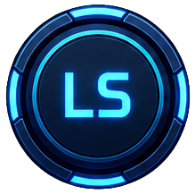 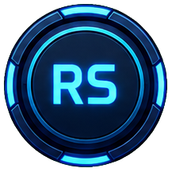  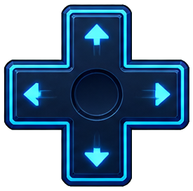 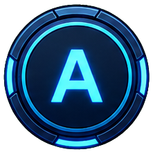 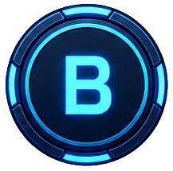 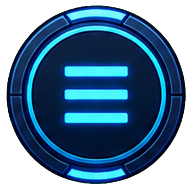

| Action | Input |
|---|---|
| Move | Left stick |
| Aim | Right stick |
| Shoot | Right trigger (RT) |
| Pause | ☰ Menu |
| Menu navigation | D-pad / left stick |
| Menu confirm | A |
| Menu back | B |

---

## PlayStation controller (DualSense / DualShock 4)

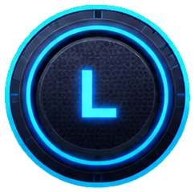 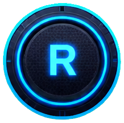 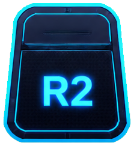 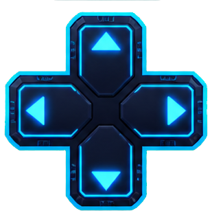 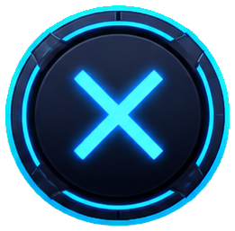 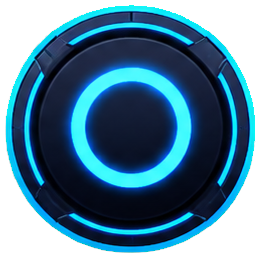 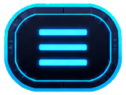

| Action | Input |
|---|---|
| Move | Left stick |
| Aim | Right stick |
| Shoot | R2 |
| Pause | Options |
| Menu navigation | D-pad / left stick |
| Menu confirm | ✕ Cross |
| Menu back | ○ Circle |

### DualSense-specific features

Connected over USB, a DualSense also gets (each toggleable in Options):

- **Rumble** — impact and explosion feedback on both motors
- **Adaptive triggers** — R2 gains firing resistance
- **Lightbar** — colour follows game state (armor level, shield, damage)

These run through the bundled `DualSenseWindows` library. A DualShock 4 or an
Xbox pad uses standard XInput/DirectInput rumble only.

---

## Twin-stick aiming

With a controller, the ship aims wherever the **right stick** points and holds
that heading when you release it. With mouse, the ship always faces the cursor.
Movement (left stick / `WASD`) is fully independent of aim in both schemes.
