# Gameplay reference

- [Modes](#modes)
- [Bestiary](#bestiary)
- [The boss](#the-boss)
- [Pickups](#pickups)
- [Parts & ship upgrades](#parts--ship-upgrades)
- [Levels](#levels)
- [Achievements](#achievements)
- [Records](#records)
- [Settings](#settings)
- [Save data](#save-data)

---

## Modes

### Campaign
Ten levels. Levels 1–9 are three authored waves each; level 10 is the boss.
Every level has its own background region, brightness and music theme, an
animated intro, and a target accuracy that rises from 65% on Level 1 to 88% on
Level 9. Progress, collected Parts and ship-upgrade ranks are saved between
sessions. Finished levels can be replayed from **Select Level** without rewinding
campaign progress.

Completing a level shows a statistics screen (enemies destroyed, accuracy, armor
remaining, Parts collected). Reaching 75% armor and the level's target accuracy
is required to clear it cleanly.

### Horde
Endless. Each wave adds more and tougher enemies. You get one bonus pickup per
wave and a choice of cyclic, Horde-only upgrades between waves. Background is
chosen at random. The mode records your best score and highest wave reached.

### Run
One-hit rules: a single contact ends the run. Enemies and asteroids spawn on
timers that tighten as you survive. Only defensive pickups appear (shield,
time-slow). The mode records your best survival time as `MM:SS`.

### Tutorial
Optional, offered on a new campaign. Walks through movement, firing, scoring,
armor, the shield pickup, Parts collection and the ship-upgrade screen. Skipping
it unlocks an achievement.

---

## Bestiary

All stats are from `assets/data/gameplay/enemies.json`.

### Large Meteor


| Health | Contact damage | Speed | Score |
|---|---|---|---|
| 50 | 30 | 100 | 100 |

Drifts in a straight line, rotating slowly. When destroyed it splits into two
Small Meteors that inherit its position and fly apart. Four sprite variants.
<br clear="all">

### Small Meteor


| Health | Contact damage | Speed | Score |
|---|---|---|---|
| 30 | 15 | 200 | 50 |

Faster than the large version and does not split. Four sprite variants.
<br clear="all">

### Kamikaze Saucer


| Health | Contact damage | Speed | Score |
|---|---|---|---|
| 20 | 40 | 500 | 200 |

Locks onto the ship, spins up, and accelerates into a ramming run. No ranged
attack — the danger is the collision. It overshoots and loops back, so strafe
early rather than trying to out-run it.
<br clear="all">

### Shooter


| Health | Contact damage | Speed | Score | Fire interval |
|---|---|---|---|---|
| 30 | 20 | 200 | 250 | 1.0 s |

Keeps its distance and alternates fire between its two cannons. Fragile; the
threat is volume of fire when several are on screen.
<br clear="all">

### Spinner


| Health | Contact damage | Speed | Score | Fire interval |
|---|---|---|---|---|
| 100 | 30 | 150 | 400 | 1.0 s |

Travels along a sine-wave path while rotating, firing from three emitters in
three directions at once. Predictable movement, hard to approach head-on.
<br clear="all">

### Missile Carrier


| Health | Contact damage | Speed | Score | Launch interval |
|---|---|---|---|---|
| 80 | 25 | 135 | 350 | 3.0 s |

Launches slow homing missiles. The missiles are destructible — shoot them down
if you can't break line of sight.
<br clear="all">

### Laser Turret


| Health | Contact damage | Speed | Score | Beam damage | Beam width |
|---|---|---|---|---|---|
| 60 | 25 | 115 | 500 | 20 | 18 |

Patrols along a screen edge and sweeps a continuous beam that only hits the
player. Time your crossings between sweeps.
<br clear="all">

### Shooter Station


| Health | Contact damage | Speed | Score | Build interval | Shield window |
|---|---|---|---|---|---|
| 200 | 35 | 55 | 900 | 5.0 s | 3.0 s |

Slow and heavily armoured. Periodically constructs a Shooter, raising a shield
over its launch bay while it works. Punish it in the gaps between builds.
<br clear="all">

### Reflector Gunship


| Health | Contact damage | Speed | Score | Action interval | Shield window |
|---|---|---|---|---|---|
| 150 | 40 | 560 | 750 | 0.5 s | 3.0 s |

Very fast, moves on a wide sine path, fires twin cannons. Periodically raises a
red shield that reflects your bullets straight back — hold fire while it's up.
<br clear="all">

---

## The boss

**Cybermind** — the boss of Level 10, *The Last Horizon*
(`assets/data/gameplay/boss.json`). Three phases, fought over one continuous
encounter:

| Phase | Target | What happens |
|---|---|---|
| 1 | 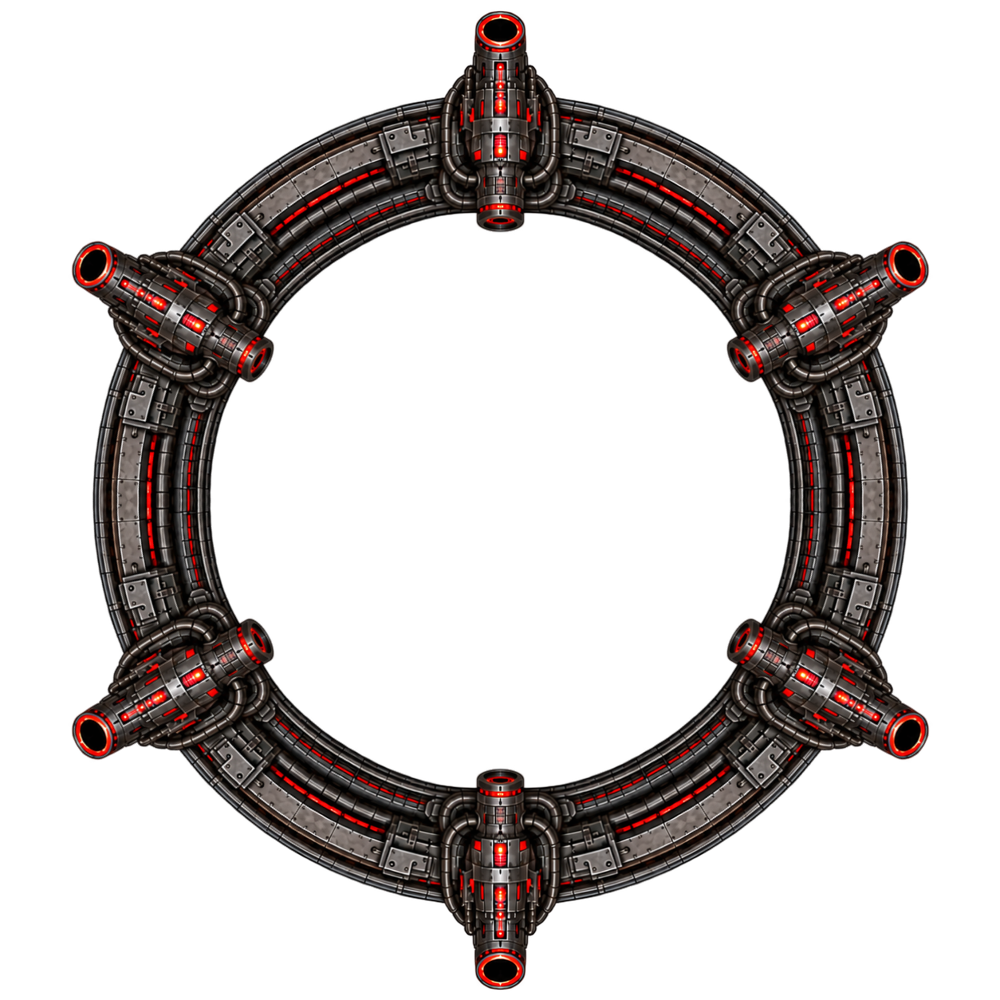 Outer ring | The rotating ring takes damage while the boss spawns Kamikaze and edge Shooter reinforcements. |
| 2 | 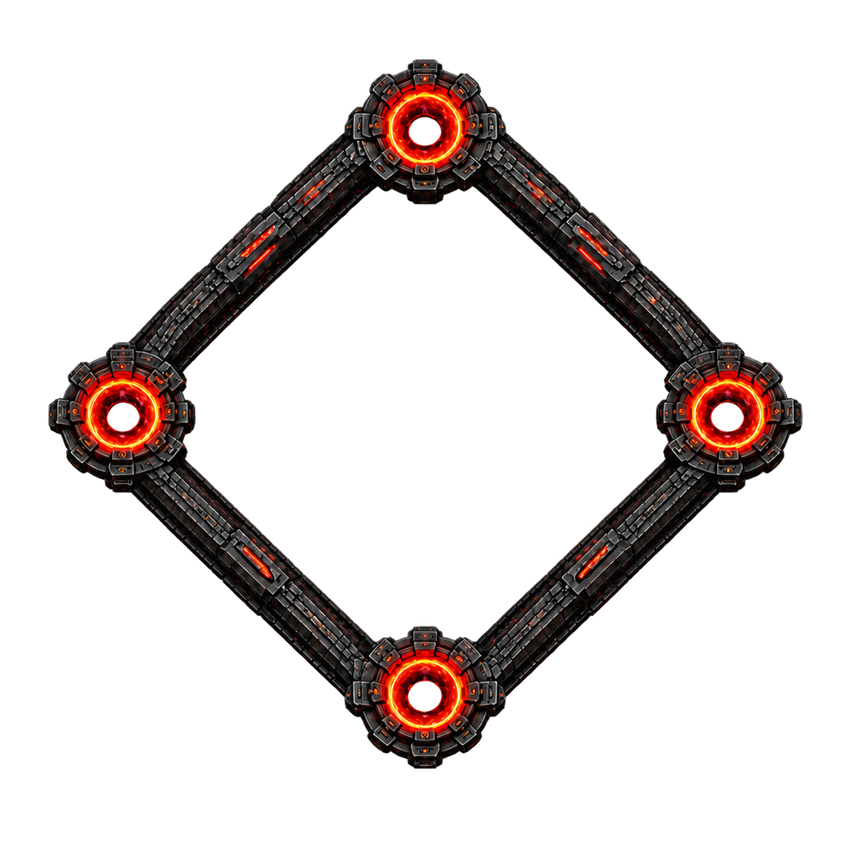 Diamond frame | The frame cycles a rotating shield; strike the exposed segments between rotations while it spawns portals and asteroids. |
| 3 |  Shielded core | The core alternates inner and outer shields, fires wide beams, and spawns turrets and stations at fixed insets until destroyed. |

Each phase drops its own set of bonus pickups. Clearing the boss without taking
damage unlocks **I'm the Boss Here!**.

---

## Pickups

From `assets/data/gameplay/pickups.json`. Timed pickups stack their timer if
re-collected.

| Icon | Pickup | Effect | Duration |
|:---:|---|---|---|
| 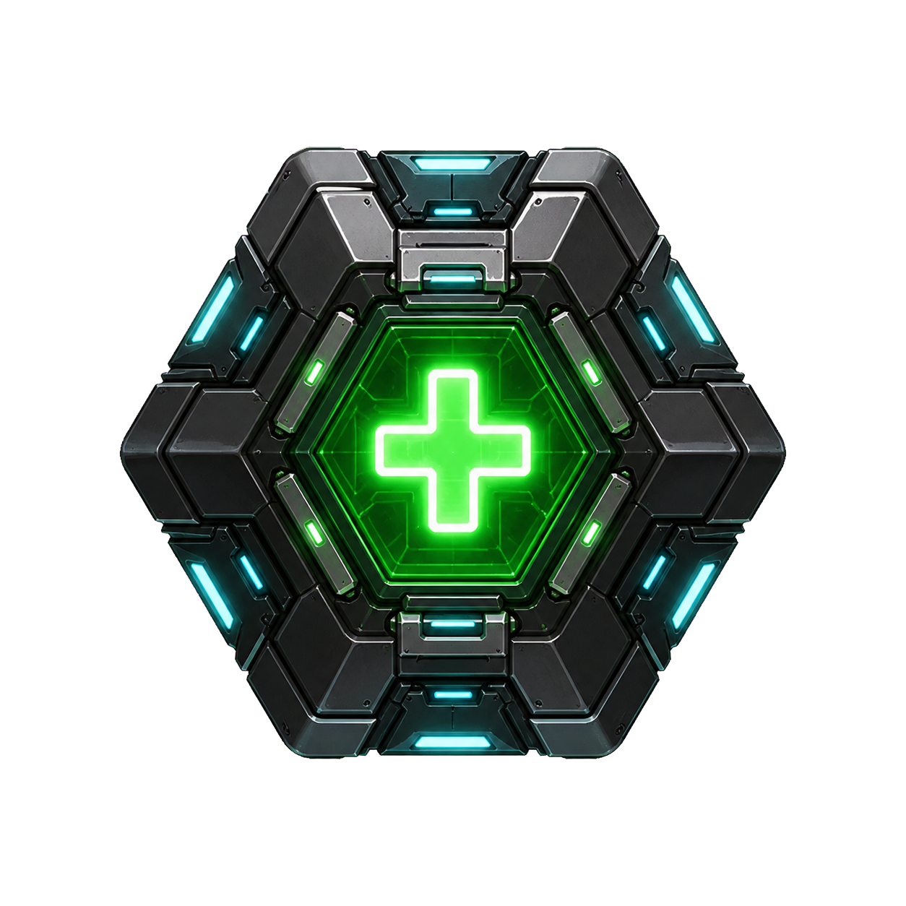 | Health | Restores 25% of maximum armor | instant |
| 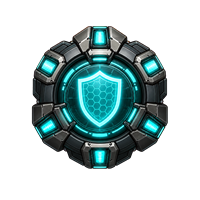 | Shield | 100-point shield that absorbs damage and continuously drains | ~10 s |
| 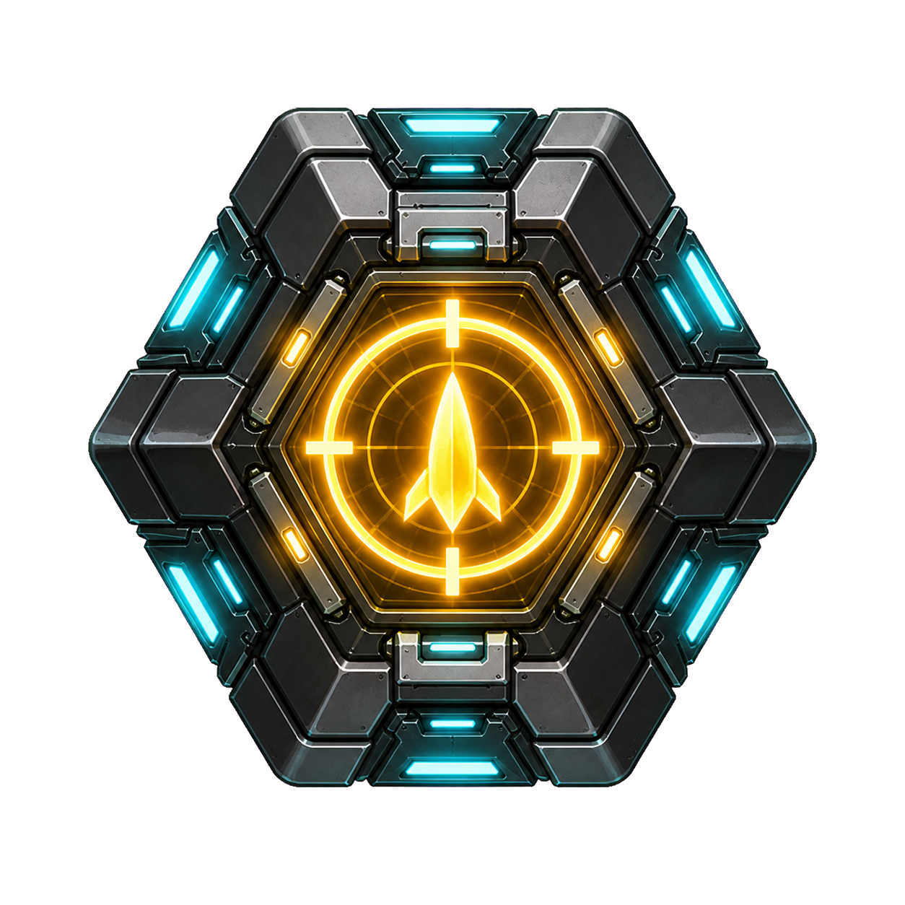 | Homing Bullets | Your shots curve toward enemies within a 90° cone (480°/s turn) | 10 s |
| 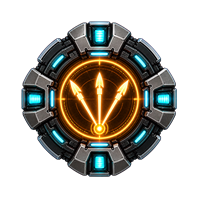 | Triple Shot | Fires three bullets in a ±5° spread | 10 s |
| 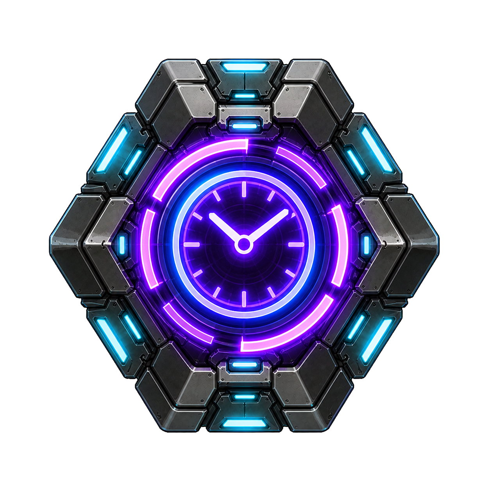 | Time Slow | World runs at ×0.35, audio pitched down; the ship is unaffected | 5 s |
| 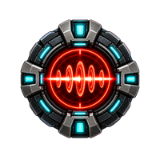 | Laser | A continuous beam that damages every 0.1 s | 10 s |
| 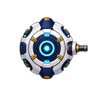 | Helper Bot | An indestructible drone orbits the ship and fires homing shots at the nearest enemy for the rest of the level | until level end |
| 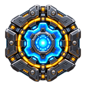 | Part | A ship Part — see below. Vanishes if not collected within 5 seconds | — |

The HUD shows a labelled meter for each active timed effect.

---

## Parts & ship upgrades

Enemies occasionally drop a **Part** with a short 5-second pickup window. Parts
are a finite campaign resource, spent in the **Ship Upgrades** screen (reached
from Select Level or the pause menu).

| Branch | Effect per rank |
|---|---|
| **Armor** | +25% maximum armor |
| **Flight Engines** | +10% speed and thrust |
| **Fire Rate** | +15% shots per second |
| **Bonus Duration** | +1 second to timed bonuses |

Maxing every branch unlocks **Looking Sharp**. Upgrade ranks are stored in
`campaign.json` and are clamped to the maximum allowed by your campaign progress.
Replaying an earlier level uses your current ranks.

---

## Levels

| # | Name | Region | Music theme |
|:--:|---|---|---|
| 1 | Blue Frontier | Blue Nebula | Theme 1 |
| 2 | Emerald Crossing | Emerald Aurora | Theme 1 |
| 3 | Shattered Belt | Violet Clouds | Theme 1 |
| 4 | Rose Siege | Rose Nursery | Theme 2 |
| 5 | Asteroid Wake | Asteroid Belt | Theme 2 |
| 6 | Frozen Graveyard | Frozen Expanse | Theme 2 |
| 7 | Crimson Entry | Red Storm | Theme 3 |
| 8 | Ion Storm | Ion Storm | Theme 3 |
| 9 | Void Threshold | Deep Void | Theme 3 |
| 10 | The Last Horizon | Last Horizon | Boss track |

Horde Mode uses Theme 3 and a random region; Run Mode uses Theme 2 and the
Violet Clouds region.

---

## Achievements

Defined in `assets/data/achievement_definitions.json`.

| Icon | Title | How to unlock |
|:---:|---|---|
| 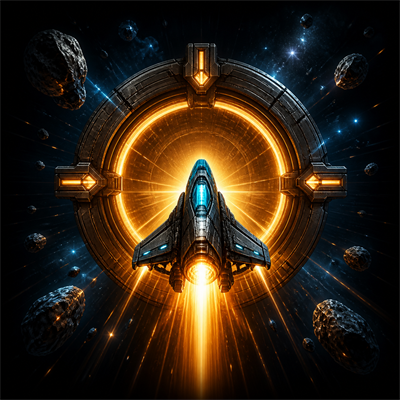 | Off We Go! | Complete Level 1 |
| 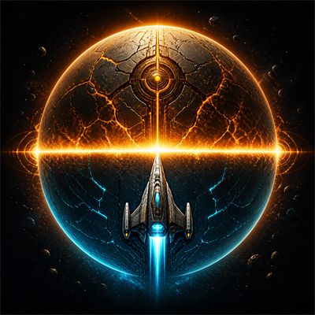 | Crossing the Equator | Complete Level 5 |
| 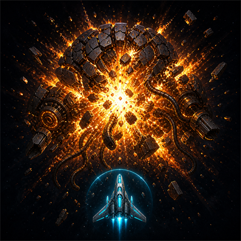 | That's All! | Complete Level 10 |
| 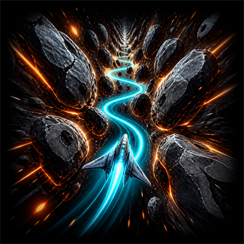 | Please, Make It Stop! | Survive for 1 minute in Run Mode |
| 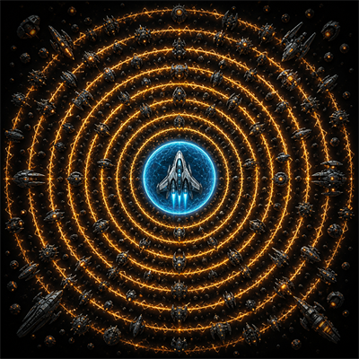 | Nothing Can Stop Me | Survive 5 waves in Horde Mode |
| 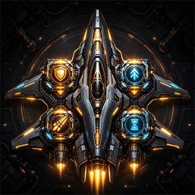 | Looking Sharp | Upgrade every ship system to its maximum rank |
| 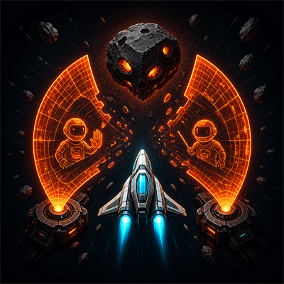 | Overconfident | Skip the tutorial |
| 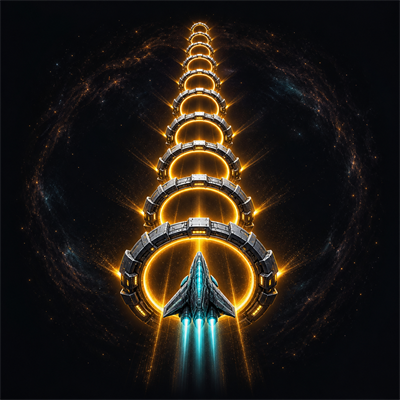 | Not My First Time | Complete a new campaign from start to finish without dying |
| 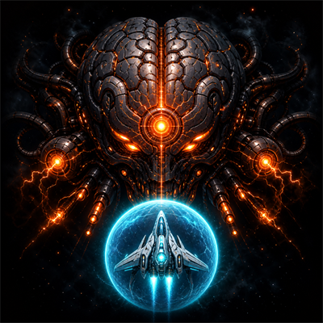 | I'm the Boss Here! | Complete Level 10 without taking any damage |

Unlocked achievements are stored in `achievements.json` and shown as a toast
in-game and in the Achievements screen.

---

## Records

The Records screen tracks, independently of campaign progress:

- **Campaign** — best score for each individual level
- **Horde** — best score and highest wave reached
- **Run** — best survival time

Records live in `records.json`. Starting a new campaign never clears them.

---

## Settings

| Group | Option | Notes |
|---|---|---|
| Graphics | Resolution | Applied immediately, with a timed confirm/revert prompt |
| Graphics | Window Mode | Fullscreen / Windowed / Borderless |
| Graphics | V-Sync | On / Off |
| Graphics | FPS Counter | On / Off |
| Graphics | Post-processing | Toggles bloom, grading, vignette and distortion |
| Audio | Master / Music / Effects | Independent volume sliders |
| Controls | Keyboard & mouse bindings | Move, aim and fire are all rebindable |
| Controls | Gamepad Vibration | DualSense / Xbox rumble |
| Controls | Adaptive Triggers | DualSense R2 resistance |
| Controls | Controller Lightbar | DualSense lightbar tint follows game state |
| Gameplay | Screen Shake | On / Off |
| Gameplay | Score Popups | On / Off |
| Language | English / Spanish / Russian / Ukrainian / Arabic | Full UI localization |

All settings persist to `settings.json` (see below). "Restore defaults" is
available per group.

---

## Save data

The game writes per-player files to:

```
%LOCALAPPDATA%\Alone Bull Company\Until Last Asteroid\
```

| File | Contents |
|---|---|
| `settings.json` | graphics, audio, control bindings, gameplay and language settings |
| `campaign.json` | campaign progress, collected Parts, ship-upgrade ranks |
| `records.json` | per-level scores, Horde best score / wave, Run best time |
| `achievements.json` | unlocked achievements |

If `%LOCALAPPDATA%` cannot be resolved, the game falls back to `user_data\` next
to the executable. All writes go through an atomic replace, and any file that
fails to parse on load is renamed to `<name>.corrupt` (or `.corrupt.1`, `.2`, …)
instead of being overwritten, so a bad file never silently destroys a save.
